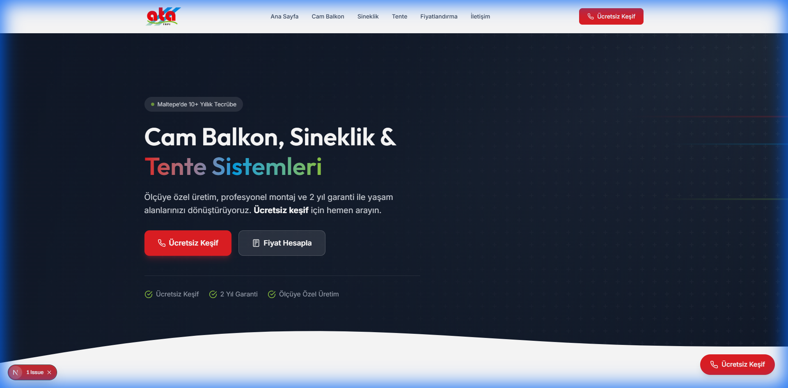
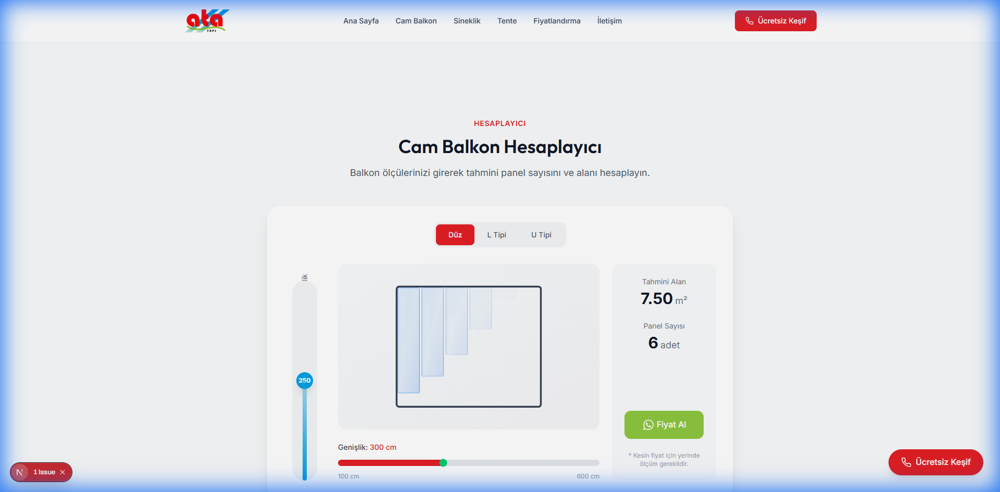
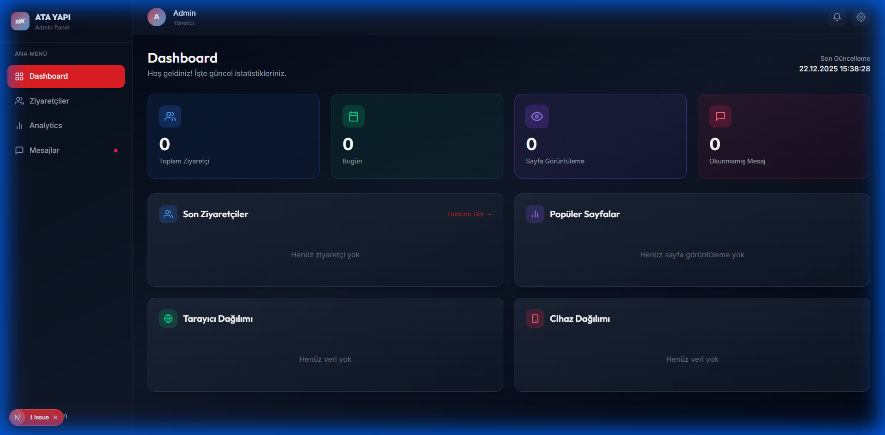
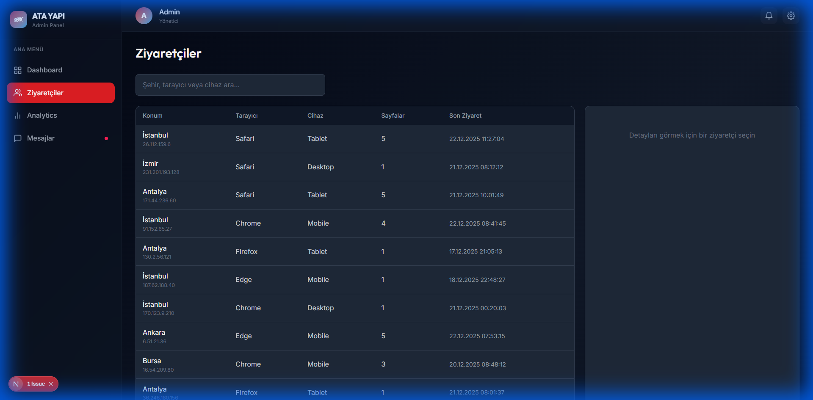
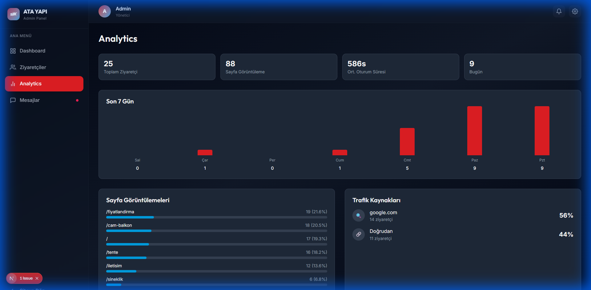

<p align="center">
  
</p>

<h1 align="center">🏗️ ATA YAPI</h1>

<p align="center">
  <strong>Cam Balkon, Sineklik & Tente Sistemleri</strong><br/>
  Maltepe, İstanbul
</p>

<p align="center">
  <a href="#özellikler">Özellikler</a> •
  <a href="#teknolojiler">Teknolojiler</a> •
  <a href="#kurulum">Kurulum</a> •
  <a href="#ekran-görüntüleri">Ekran Görüntüleri</a> •
  <a href="#admin-paneli">Admin Paneli</a>
</p>

---

## ✨ Özellikler

### 🌐 Müşteri Tarafı
- **Modern & Premium Tasarım** - Profesyonel ve şık arayüz
- **Responsive** - Tüm cihazlarda mükemmel görünüm
- **Premium Animasyonlar** - Framer Motion ile akıcı geçişler
- **Balkon Hesaplayıcısı** - Düz, L ve U tipi için interaktif hesaplama
- **WhatsApp Entegrasyonu** - Tek tıkla iletişim
- **SEO Optimize** - Arama motorlarına uygun yapı

### 🔧 Admin Paneli
- **Dashboard** - Anlık istatistikler
- **Ziyaretçi Takibi** - IP, konum, tarayıcı bilgileri
- **Analytics** - Sayfa görüntülemeleri ve grafikler
- **Mesaj Yönetimi** - Müşteri taleplerini takip
- **Teklif Geçmişi** - Oluşturulan tekliflerin listesi

### 📝 Teklif Sistemi
- **PIN Korumalı Erişim** - Yetkisiz erişimi engeller
- **Dinamik Form** - İş kalemleri ekleme/silme
- **Otomatik Hesaplama** - Toplam + KDV
- **PDF Oluşturma** - Profesyonel teklif dokümanı
- **WhatsApp Entegrasyonu** - Tek tıkla müşteriye gönderim

---

## 🛠️ Teknolojiler

| Kategori | Teknoloji |
|----------|-----------|
| Framework | Next.js 14 (App Router) |
| Dil | TypeScript |
| Styling | Tailwind CSS |
| Animasyon | Framer Motion |
| PDF | jsPDF |
| Deployment | Vercel |

---

## 🚀 Kurulum

```bash
# Repo'yu klonlayın
git clone https://github.com/your-username/ata-yapi-web.git

# Klasöre girin
cd ata-yapi-web

# Bağımlılıkları yükleyin
npm install

# Geliştirme sunucusunu başlatın
npm run dev
```

Tarayıcıda açın: `http://localhost:3000`

---

## 📸 Ekran Görüntüleri

### Ana Sayfa
<p align="center">
  
</p>

Premium hero bölümü ile etkileyici ilk izlenim.

---

### Balkon Hesaplayıcısı
<p align="center">
  
</p>

Düz, L ve U tipi balkonlar için interaktif hesaplayıcı. Her bölüm için ayrı ölçü girişi ve anlık m²/panel hesabı.

---

## 🔐 Admin Paneli

Admin paneline erişim: `/admin`

### Dashboard
<p align="center">
  
</p>

Toplam ziyaretçi, günlük istatistikler, popüler sayfalar ve tarayıcı dağılımı.

---

### Ziyaretçi Takibi
<p align="center">
  
</p>

Detaylı ziyaretçi bilgileri: IP adresi, konum koordinatları, tarayıcı, cihaz ve gezilen sayfalar.

---

### Analytics
<p align="center">
  
</p>

7 günlük trafik grafiği, sayfa görüntülemeleri ve trafik kaynakları.

---

## 📝 Teklif Sistemi

Teklif oluşturma: `/teklif` (PIN: `1234`)

<p align="center">
  
</p>

Personelin müşteri tekliflerini hızlıca oluşturması için:
- Müşteri bilgileri ve proje adresi
- Dinamik iş kalemi listesi
- Otomatik toplam hesaplama
- PDF indirme ve WhatsApp gönderim

---

## 📁 Proje Yapısı

```
ata-yapi-web/
├── src/
│   ├── app/
│   │   ├── admin/          # Admin paneli sayfaları
│   │   ├── teklif/         # Teklif oluşturma
│   │   ├── cam-balkon/     # Cam balkon sayfası
│   │   ├── sineklik/       # Sineklik sayfası
│   │   ├── tente/          # Tente sayfası
│   │   ├── fiyatlandirma/  # Fiyatlandırma sayfası
│   │   ├── iletisim/       # İletişim sayfası
│   │   └── page.tsx        # Ana sayfa
│   ├── components/
│   │   ├── calculator/     # Hesaplayıcı bileşenleri
│   │   └── home/           # Ana sayfa bölümleri
│   └── lib/                # Utility fonksiyonlar
├── public/                 # Statik dosyalar
└── docs/                   # Dokümantasyon görselleri
```

---

## 📱 Sayfalar

| Route | Açıklama |
|-------|----------|
| `/` | Ana sayfa |
| `/cam-balkon` | Cam balkon sistemleri |
| `/sineklik` | Sineklik sistemleri |
| `/tente` | Tente sistemleri |
| `/fiyatlandirma` | Fiyat politikası |
| `/iletisim` | İletişim formu |
| `/teklif` | Teklif oluşturma (PIN korumalı) |
| `/admin` | Admin dashboard |
| `/admin/visitors` | Ziyaretçi listesi |
| `/admin/analytics` | Detaylı istatistikler |
| `/admin/messages` | Mesaj yönetimi |
| `/admin/quotes` | Teklif geçmişi |

---

## 🎨 Marka Renkleri

| Renk | HEX | Kullanım |
|------|-----|----------|
| 🔴 Primary | `#E31E24` | CTA butonları, vurgular |
| 🔵 Secondary | `#00A0E3` | İkincil aksiyonlar |
| 🟢 Accent | `#8DC63F` | WhatsApp, başarı durumları |

---

## 📄 Lisans

Bu proje özel kullanım için geliştirilmiştir.

---

<p align="center">
  <strong>ATA YAPI</strong> | Maltepe, İstanbul<br/>
  <sub>Built with ❤️ using Next.js</sub>
</p>
